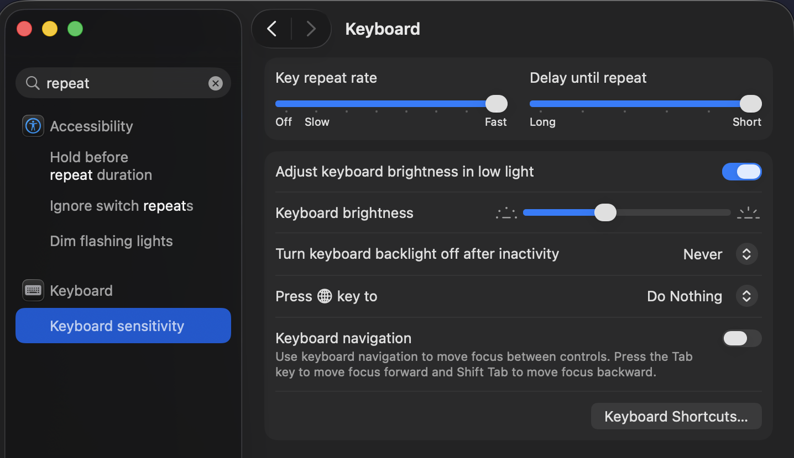

# dotfiles

This repo is used to host my dev setup config and contains a list of useful tools I use.

## List of tools

- [Brew](https://brew.sh/): Package manager
- [Aerospace](https://github.com/nikitabobko/AeroSpace): Window manager, primarily used to create virtual spaces
- [JankyBorders](https://github.com/FelixKratz/JankyBorders): Lightweight window border system for macOS
- [Ghostty](https://ghostty.org/): Terminal emulator
- [zsh](https://www.zsh.org/): command-line interpreter for shell scripts
- [Neovim](https://github.com/neovim/neovim): Vim-fork focused on extensibility and usability
- [Zen Browser](https://zen-browser.app/): Browser with Workspaces, great for keeping tabs organized per project
- [Linearmouse](https://linearmouse.app/): reverse mouse scroll and keep touchpad natural scrolling
- [Raycast](https://www.raycast.com/): Replace Spotlight with a bunch of productivity tools
- [Rectangle](https://rectangleapp.com/): Move and resize windows using keyboard shortcuts
- [Lazygit](https://github.com/jesseduffield/lazygit): terminal based git ui (there is a plugin for neovim)

## Purpose

The main idea behind this setup is to be able to navigate to your most used applications without having to search for them. Instead we rely on a combination of keybindings and workspaces for to have applications in fixed place.

It is an attempt at a non-cluttered workspace, focused on use for 1 monitor. However it can be adapted for use in a multi-screen setup.

## Goal

Have one setup script that installs my dev setup on any macOS device.

## Installation

Fork this repository as a starting point to make your personal setup. Check out your repository into ~/dotfiles
Then run the installation script, which will:

- Backup locally detected configuration files
- Brew install list of tools
- symlink dotfiles/config to ~/.config/

Your installed applications will look at ~/.config/ but these files are linked to the config in the ~/dotfiles repository. If you change your configuration you can commit the changes to the repo to keep your repo in sync.

## Recommended MacOS Settings

- Key repeat rate: makes vim navigation more fluid

- Group windows by application (Desktop & Dock -> Scroll down -> Group windows by application)
